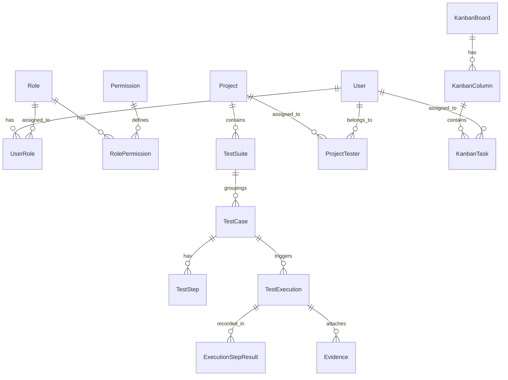
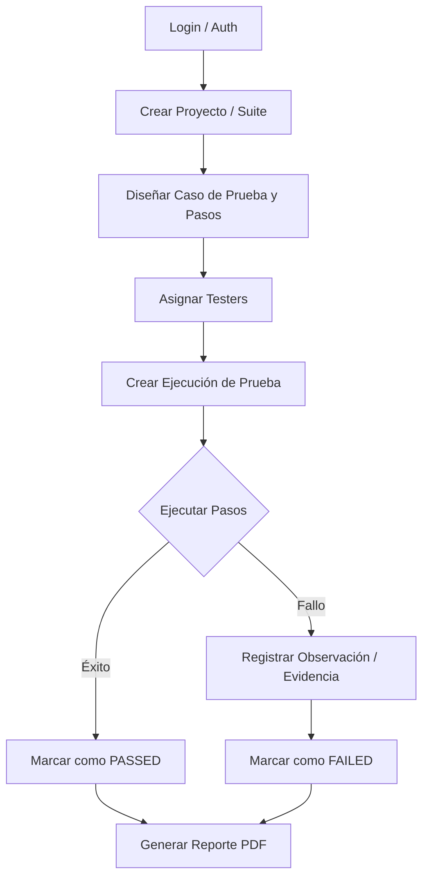

# QAMS - Quality Assurance Management System (Backend)


## 📌 Descripción del Proyecto
**QAMS (Quality Assurance Management System)** es un sistema robusto diseñado para la gestión integral del ciclo de vida de aseguramiento de calidad de software. Permite a los equipos de QA planificar proyectos, diseñar casos de prueba, ejecutar pruebas con evidencias detalladas y realizar el seguimiento de hallazgos mediante tableros Kanban y reportes automatizados.

El sistema está construido bajo principios de **Arquitectura Limpia (Clean Architecture)**, garantizando escalabilidad, mantenibilidad y una alta calidad de código siguiendo los principios **SOLID**.

---

## 🎯 Objetivos

### Objetivo General
Desarrollar una plataforma centralizada y automatizada para la gestión de procesos de calidad de software que optimice la comunicación entre desarrolladores y testers, mejore la trazabilidad de los hallazgos y reduzca el tiempo de entrega de versiones estables de software.

### Objetivos Específicos
*   **Gestión de Estructura**: Permitir la organización de pruebas por Proyectos, Suites de Prueba y Casos de Prueba.
*   **Control de Ejecución**: Facilitar la ejecución de pruebas con captura de resultados por paso, observaciones y evidencias adjuntas.
*   **Monitoreo Visual**: Implementar un tablero Kanban para el flujo de tareas y un Dashboard de indicadores clave (Burndown, Drawdown, etc.).
*   **Reportabilidad**: Generar reportes técnicos en formato PDF con el resumen de salud de los proyectos.
*   **Seguridad**: Garantizar un acceso seguro basado en roles y permisos (RBAC) con autenticación JWT.

---

## 🛠️ Stack Tecnológico
- **Lenguaje**: C# (.NET 9)
- **Base de Datos**: PostgreSQL
- **ORM**: Entity Framework Core
- **Seguridad**: JWT (JSON Web Tokens) & BCrypt
- **Documentación API**: Swagger / OpenAPI
- **Logging**: Serilog
- **Contenedores**: Docker & Docker Compose
- **Despliegue**: Render (Soporte nativo para Blueprints)

---

## 🧱 Arquitectura del Sistema
El proyecto implementa **Clean Architecture** dividida en 4 capas:

1.  **QAMS.Domain**: Entidades, interfaces de repositorio, excepciones y servicios de dominio.
2.  **QAMS.Application**: Casos de uso, servicios de aplicación, DTOs y perfiles de mapeo (AutoMapper).
3.  **QAMS.Infrastructure**: Implementación de persistencia (DbContext), seguridad, almacenamiento de archivos y envío de correos.
4.  **QAMS.Api**: Controladores REST, middleware de excepciones y configuración (Program.cs).

---

## 📊 Diagramas

### Diagrama de Entidad Relación (MER)


### Flujo de Ejecución de Pruebas


---

## 🚀 Cómo Compilar y Ejecutar

### Requisitos Previos
*   [.NET 9 SDK](https://dotnet.microsoft.com/download/dotnet/9.0)
*   [Docker Desktop](https://www.docker.com/products/docker-desktop)
*   [PostgreSQL](https://www.postgresql.org/) (Si no se usa Docker)

### Ejecución con Docker (Recomendado)
El proyecto incluye un entorno listo para usar con Docker Compose que levanta tanto el API como la Base de Datos.

```bash
# Clonar el proyecto
git clone <url-del-repositorio>
cd QAMS

# Construir e iniciar contenedores
docker-compose up --build -d
```
El API estará disponible en `http://localhost:5000` y Swagger en `http://localhost:5000/swagger`.

### Ejecución Local (.NET CLI)
1.  Actualizar la cadena de conexión en `appsettings.json`.
2.  Ejecutar las migraciones:
    ```bash
    dotnet ef database update --project src/QAMS.Infrastructure --startup-project src/QAMS.Api
    ```
3.  Ejecutar el proyecto:
    ```bash
    dotnet run --project src/QAMS.Api
    ```

---

## 🧪 Pruebas
El proyecto utiliza XUnit para pruebas unitarias. Para ejecutarlas:
```bash
dotnet test
```

---

## 🛡️ Seguridad
El sistema utiliza autenticación basada en JWT. 
*   **Registro/Login**: Endpoints abiertos para obtener el token.
*   **Endpoints Protegidos**: Requieren el header `Authorization: Bearer <token>`.
*   **Permisos**: Los endpoints verifican permisos granulares definidos en la base de datos (Ej: `Projects.View`, `TestCases.Create`).

---

## 📂 Estructura de Carpetas
```text
QAMS/
├── src/
│   ├── QAMS.Api/             # Capa de Entrada (Controllers)
│   ├── QAMS.Application/     # Capa de Lógica de Negocio (DTOs, Services)
│   ├── QAMS.Domain/          # Capa de Dominio (Entities, Ports)
│   └── QAMS.Infrastructure/  # Capa de Datos y Servicios Externos
├── tests/                    # Pruebas Unitarias e integración
├── QAMS.sln                  # Solución de Visual Studio
├── docker-compose.yml        # Configuración de Docker
└── render.yaml               # Configuración de despliegue en Render
```
