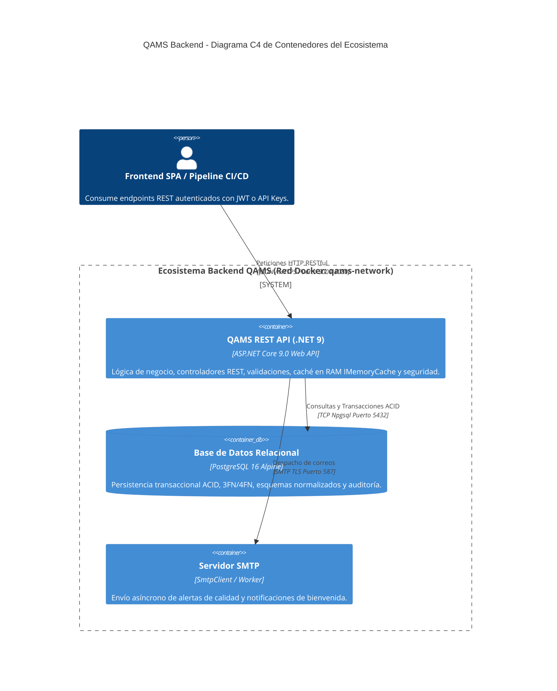
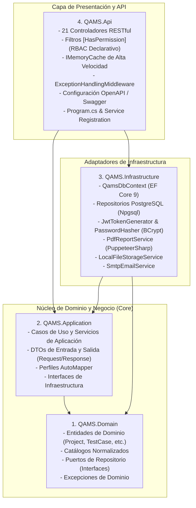
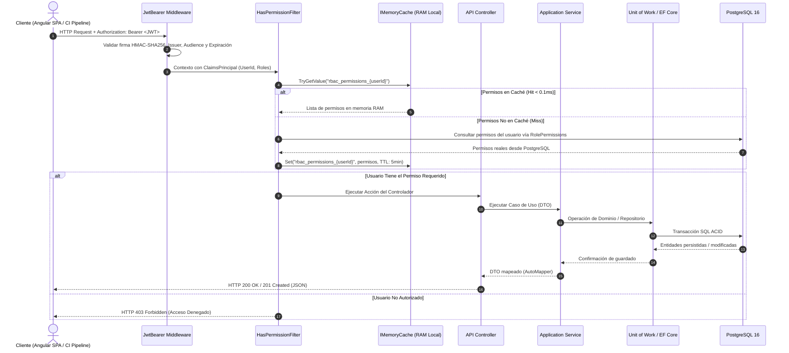
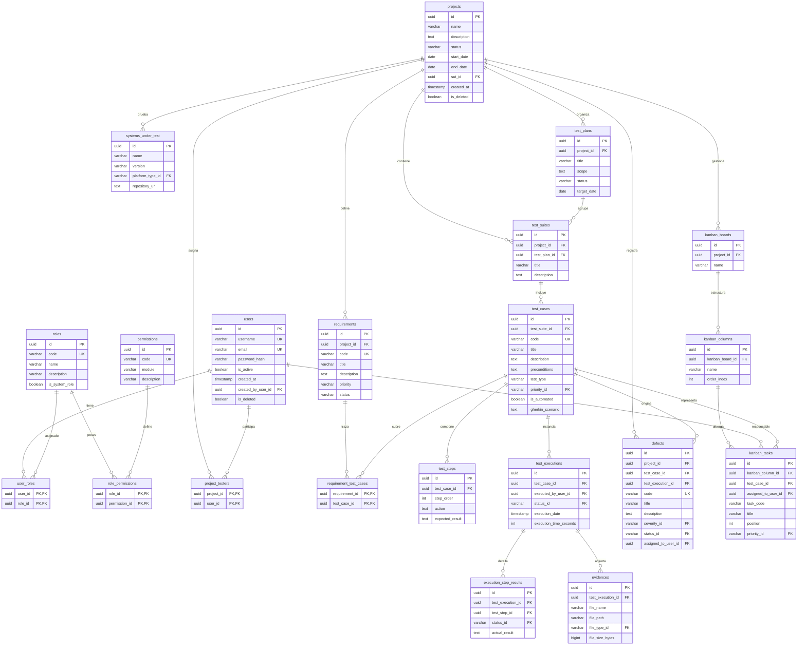
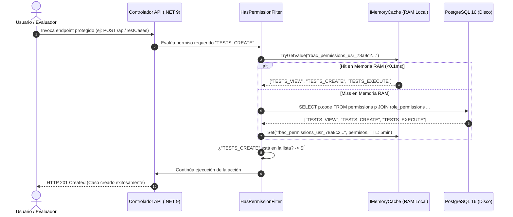

# 🛡️ QAMS Backend — Quality Assurance Management System (REST API)
> **API RESTful Empresarial de Misión Crítica para la Gestión del Ciclo de Vida de Pruebas de Software (STLC), Clean Architecture, Gobernanza de Calidad, Mitigación OWASP Top 10 y Conformidad con ISTQB® CTFL v4.0 e ISO/IEC/IEEE 29119**

[](https://dotnet.microsoft.com/)
[](https://docs.microsoft.com/dotnet/csharp/)
[](https://www.postgresql.org/)
[](https://learn.microsoft.com/ef/core/)
[](https://learn.microsoft.com/aspnet/core/performance/caching/memory)
[](https://www.istqb.org/)
[](https://www.iso.org/standard/64104.html)
[](https://www.docker.com/)
[](LICENSE)

---

## 📑 Tabla de Contenidos
1. [Descripción General y Justificación del Proyecto](#1-descripción-general-y-justificación-del-proyecto)
   - [Justificación Arquitectónica y de Negocio](#11-justificación-del-proyecto)
   - [Objetivo General y Objetivos Específicos](#12-objetivos-del-proyecto)
2. [Arquitectura del Sistema (Clean Architecture & SOLID)](#2-arquitectura-del-sistema-clean-architecture--solid)
   - [Diagrama C4 de Contenedores Backend](#21-diagrama-c4-de-contenedores-backend)
   - [Diagrama de Clean Architecture en 4 Capas](#22-diagrama-de-clean-architecture-4-capas)
   - [Pipeline de Procesamiento HTTP y Filtro RBAC](#23-pipeline-de-procesamiento-http-y-filtro-rbac)
3. [Modelo de Base de Datos y Gobernanza (PostgreSQL 16)](#3-modelo-de-base-de-datos-y-gobernanza-postgresql-16)
   - [Diagrama Entidad-Relación (MER / DER Completo)](#31-diagrama-entidad-relación-mer--der-completo)
   - [Gobernanza de Datos: Auditoría Automática y Soft-Delete](#32-gobernanza-de-datos-auditoría-automática-y-soft-delete)
4. [Estrategia de Caché de Alto Rendimiento (IMemoryCache)](#4-estrategia-de-caché-de-alto-rendimiento-imemorycache)
   - [Diseño y Rendimiento en Memoria RAM](#41-diseño-y-rendimiento-en-memoria-ram)
   - [Diagrama de Secuencia: Patrón Cache-Aside RBAC](#42-diagrama-de-secuencia-patrón-cache-aside-rbac)
5. [Módulos del API RESTful (Detalle Técnico de Controladores)](#5-módulos-del-api-restful-detalle-técnico-de-controladores)
6. [Seguridad y Mitigación OWASP Top 10](#6-seguridad-y-mitigación-owasp-top-10)
7. [Estructura del Proyecto y Árbol de Directorios](#7-estructura-del-proyecto-y-árbol-de-directorios)
8. [Stack Tecnológico Detallado](#8-stack-tecnológico-detallado)
9. [Instalación, Migraciones y Puesta en Marcha](#9-instalación-migraciones-y-puesta-en-marcha)
10. [Pruebas Automatizadas](#10-pruebas-automatizadas)

---

## 1. Descripción General y Justificación del Proyecto

### 1.1 Justificación del Proyecto

En el desarrollo de software corporativo de alta criticidad, la ausencia de una infraestructura centralizada y trazable para el Aseguramiento de la Calidad (QA) produce cuellos de botella severos, inconsistencias en el seguimiento de defectos y exposición de datos confidenciales.

La mayoría de los sistemas comerciales del mercado operan como plataformas SaaS cerradas, cuyos costos recurrentes por usuario resultan financieramente prohibitivos para equipos de medianas y grandes organizaciones. Adicionalmente, el almacenamiento de defectos, credenciales de entornos de prueba y diagramas de arquitectura en servidores públicos de terceros entra en conflicto directo con normativas estrictas de soberanía de datos (GDPR, ISO/IEC 27001).

**QAMS Backend** fue diseñado desde sus cimientos para resolver este desafío, proporcionando una **API RESTful de alto rendimiento, autohospedada (*Self-Hosted*) y transaccional**, que implementa los principios de **Clean Architecture**, **Domain-Driven Design (DDD)** y conformidad estricta con el syllabus internacional **ISTQB® CTFL v4.0** y el estándar **ISO/IEC/IEEE 29119**.

---

### 1.2 Objetivos del Proyecto

#### Objetivo General
Construir una API RESTful empresarial modular, escalable y altamente segura que centralice y gobierne el Ciclo de Vida de Pruebas de Software (STLC), garantizando persistencia relacional normalizada en PostgreSQL 16, tiempos de respuesta ultra veloces en memoria RAM y trazabilidad bidireccional desde requisitos hasta defectos.

#### Objetivos Específicos
1. **Garantizar Conformidad con ISTQB CTFL v4.0 e ISO 29119:** Proveer modelos y servicios para los 6 capítulos del syllabus (Fundamentos, Pruebas Estáticas e Inspecciones de Fagan, Técnicas de Diseño de Pruebas, Pruebas Exploratorias basadas en sesiones, Gestión de Riesgos y Quality Gates).
2. **Implementar una Matriz de Trazabilidad RTM Transaccional:** Mapear en tiempo real las relaciones $M:N$ entre Requisitos $\leftrightarrow$ Casos de Prueba $\leftrightarrow$ Ejecuciones $\leftrightarrow$ Defectos.
3. **Asegurar Tiempos de Respuesta P95 < 20ms:** Integrar una capa de caché en memoria de alta velocidad mediante **`IMemoryCache`** de ASP.NET Core bajo el patrón *Cache-Aside* para permisos RBAC y autorización atómica.
4. **Implementar Gobernanza de Datos y Trazabilidad de Auditoría:** Inyectar automáticamente metadatos de auditoría (`IAuditable`: quién creó/modificó cada entidad y fecha UTC exacta) y borrado lógico transparente (`ISoftDelete`) a nivel de DbContext.
5. **Garantizar Seguridad y Mitigación OWASP Top 10:** Implementar control de acceso granular basado en roles (**RBAC**) con validación declarativa `[HasPermission("...")]`, hashing de contraseñas con **BCrypt** (salt $\ge 12$) y autenticación mediante **JWT Bearer Tokens**.
6. **Generar Reportes Técnicos Certificados en PDF:** Implementar un motor de renderizado asíncrono con **PuppeteerSharp / Chromium headless** para emitir reportes ejecutivos con firma técnica y estadísticas consolidadas.

---

## 2. Arquitectura del Sistema (Clean Architecture & SOLID)

### 2.1 Diagrama C4 de Contenedores Backend



---

### 2.2 Diagrama de Clean Architecture (4 Capas)



---

### 2.3 Pipeline de Procesamiento HTTP y Filtro RBAC



---

## 3. Modelo de Base de Datos y Gobernanza (PostgreSQL 16)

### 3.1 Diagrama Entidad-Relación (MER / DER Completo)



---

### 3.2 Gobernanza de Datos: Auditoría Automática y Soft-Delete

En `QAMS.Infrastructure.Persistence.Configurations.QamsDbContext`, se implementan dos patrones transversales fundamentales:

1. **Auditoría Automática de Entidades (`IAuditable`)**:
   - Cada entidad que implementa `IAuditable` cuenta con los campos `CreatedAt`, `CreatedByUserId`, `UpdatedAt` y `UpdatedByUserId`.
   - En la sobreescritura de `SaveChangesAsync()`, el contexto intercepta las entradas del `ChangeTracker` e inyecta la marca de tiempo `DateTime.UtcNow` y el GUID del usuario autenticado obtenido mediante `ICurrentUserService`.
2. **Borrado Lógico Transparente (`ISoftDelete`)**:
   - Las entidades con `ISoftDelete` disponen de `IsDeleted`, `DeletedAt` y `DeletedByUserId`.
   - Se aplican filtros globales automáticos en EF Core (`HasQueryFilter(e => !e.IsDeleted)`), garantizando que las consultas estándar (`SELECT`) nunca expongan registros eliminados sin requerir cláusulas manuales `WHERE is_deleted = false`.

---

## 4. Estrategia de Caché de Alto Rendimiento (IMemoryCache)

### 4.1 Diseño y Rendimiento en Memoria RAM

Para optimizar el uso de recursos y garantizar tiempos de validación de seguridad ultra veloces sin sobrecarga de saltos de red (*network hops*), la versión actual del backend implementa **`IMemoryCache` de ASP.NET Core**:

* **Ubicación de Memoria**: Reside directamente en el espacio de memoria RAM del proceso de Kestrel.
* **Latencia de Acceso**: **< 0.1 milisegundos** por verificación de permisos RBAC.
* **Patrón Implementado**: **Cache-Aside** con expiración absoluta de **5 minutos** (`TimeSpan.FromMinutes(5)`).
* **Clave de Caché**: `rbac_permissions_{userId}` (identificador único por usuario autenticado).

---

### 4.2 Diagrama de Secuencia: Patrón Cache-Aside RBAC



---

## 5. Módulos del API RESTful (Detalle Técnico de Controladores)

El backend de QAMS expone **21 controladores RESTful** fuertemente tipados:

| Controlador | Ruta Base | Permisos Requeridos | Casos de Uso y Responsabilidad Técnica |
|---|---|---|---|
| **AuthController** | `/api/Auth` | Público / `[Authorize]` | Autenticación de usuarios, emisión de JWT tokens, refresh tokens, registro y cambio de contraseña. |
| **RolesController** | `/api/Roles` | `USERS_MANAGE` | Gestión de roles del sistema, asignación de permisos y sincronización de privilegios. |
| **UsersController** | `/api/Users` | `USERS_VIEW`, `USERS_MANAGE` | CRUD de usuarios empresariales, consulta de perfiles y asignación de roles. |
| **ProjectsController** | `/api/Projects` | `PROJECTS_VIEW`, `PROJECTS_CREATE` | Gestión de proyectos de prueba, asignación de testers y cálculo de métricas agregadas. |
| **SystemsUnderTestController** | `/api/systems-under-test` | `PROJECTS_VIEW`, `PROJECTS_UPDATE` | Configuración de aplicaciones bajo prueba y plataformas (Web, Android, iOS, API, Desktop). |
| **RequirementsController** | `/api/Requirements` | `REQUIREMENTS_VIEW`, `REQUIREMENTS_MANAGE` | Requisitos de software para trazabilidad bidireccional RTM ($M:N$). |
| **TestCasesController** | `/api/TestCases` | `TESTS_VIEW`, `TESTS_CREATE` | Gestión de casos de prueba clásicos y escenarios BDD en sintaxis Gherkin. |
| **TestSuitesController** | `/api/TestSuites` | `TESTS_VIEW`, `TESTS_CREATE` | Agrupación lógica de casos de prueba por subsistemas o módulos. |
| **TestExecutionsController** | `/api/TestExecutions` | `TESTS_EXECUTE` | Registro de ejecuciones, calificación paso a paso y carga de evidencias multimedia. |
| **TestPlansController** | `/api/TestPlans` | `PLANS_VIEW`, `PLANS_MANAGE` | Creación de planes de prueba estratégicos y flujo de aprobación conforme a ISO 29119-3. |
| **KanbanController** | `/api/Kanban` | `PROJECTS_VIEW`, `PROJECTS_UPDATE` | Tablero ágil QA de 4 columnas (*Tareas*, *Por Hacer*, *En Proceso*, *Completado*) y movimiento (`/move`). |
| **DefectsController** | `/api/Projects/{id}/defects` | `DEFECTS_VIEW`, `DEFECTS_CREATE` | Registro, seguimiento, asignación y resolución de defectos de software. |
| **DashboardController** | `/api/Dashboard` | `DASHBOARD_VIEW` | Cálculo de indicadores ISTQB (DDR, DRE, MTTR), Burndown/Drawdown y evaluación de Quality Gates. |
| **ReportsController** | `/api/Reports` | `REPORTS_VIEW` | Matriz RTM (`/rtm-matrix`) y generación de reportes ejecutivos en PDF (PuppeteerSharp). |
| **ReviewController** | `/api/review` | `REVIEWS_VIEW`, `REVIEWS_MANAGE` | Revisiones estáticas de especificaciones y código según el método de inspección de Fagan. |
| **ExploratoryController** | `/api/exploratory` | `TESTS_EXECUTE` | Gestión de sesiones de pruebas exploratorias basadas en cartas de prueba (SBTM). |
| **RisksController** | `/api/Risks` | `PROJECTS_VIEW` | Matriz de riesgos de producto e impacto de prueba. |
| **TestEnvironmentsController** | `/api/TestEnvironments` | `PROJECTS_VIEW`, `PROJECTS_UPDATE` | Catálogo y configuración de entornos de prueba (Dev, QA, Staging, Prod). |
| **ApiKeysController** | `/api/ApiKeys` | `APIKEYS_MANAGE` | Generación y revocación de API Keys seguras para pipelines CI/CD. |
| **WebhooksController** | `/api/Webhooks` | `[Authorize]` | Recepción de eventos automatizados desde pipelines externos (GitHub Actions, Jenkins). |
| **CatalogsController** | `/api/Catalogs` | `[Authorize]` | Catálogos del sistema (estados de ejecución, tipos de prueba, prioridades, severidades). |

---

## 6. Seguridad y Mitigación OWASP Top 10

| Vulnerabilidad OWASP | Estrategia de Mitigación Implementada en QAMS Backend |
|---|---|
| **A01: Broken Access Control** | Control de acceso granular RBAC con filtro declarativo `[HasPermission]`, verificación de tenencia de recursos y exclusión global de registros borrados con `ISoftDelete`. |
| **A02: Cryptographic Failures** | Hashing de contraseñas con **BCrypt** (factor de trabajo $\ge 12$), tokens **JWT firmados con HMAC-SHA256** y almacenamiento de secretos en variables de entorno seguras. |
| **A03: Injection (SQL / NoSQL)** | Consultas 100% parametrizadas a través de **Entity Framework Core 9**, anulando cualquier vector de inyección SQL. |
| **A04: Insecure Design** | Arquitectura desacoplada en Clean Architecture con validación estricta de DTOs en el pipeline de ASP.NET Core antes de llegar al dominio. |
| **A05: Security Misconfiguration** | Configuración de Kestrel con cabeceras estrictas, políticas CORS restrictivas y exclusión de stack traces en respuestas de producción. |
| **A07: Identification and Authentication Failures** | Expiración estricta de tokens JWT y bloqueo progresivo tras intentos fallidos. |

---

## 7. Estructura del Proyecto y Árbol de Directorios

```
QAMS/
├── src/
│   ├── QAMS.Domain/                     # Núcleo: Entidades, Enums, Catálogos, Puertos de Repositorio
│   │   ├── Entities/                    # Project, TestCase, TestExecution, KanbanBoard, Defect, etc.
│   │   ├── Entities/Catalogs/           # ExecutionStatus, TaskPriority, DefectSeverity, PlatformType
│   │   ├── Ports/Repositories/          # Interfaces IProjectRepository, ITestCaseRepository, etc.
│   │   └── Exceptions/                  # EntityNotFoundException, BusinessException
│   ├── QAMS.Application/                # Casos de Uso, DTOs, Mappings y Validaciones
│   │   ├── DTOs/                        # DTOs clasificados por módulo funcional
│   │   ├── Interfaces/                  # Interfaces de servicios de aplicación
│   │   ├── Mappings/                    # MappingProfile de AutoMapper
│   │   └── Services/                    # Implementación de lógica de negocio (16 servicios)
│   ├── QAMS.Infrastructure/             # Persistencia EF Core, Seguridad, Email y Reportes
│   │   ├── Persistence/Configurations/  # QamsDbContext y Fluent API de mapeo de entidades
│   │   ├── Repositories/                # Implementación de repositorios con Npgsql
│   │   ├── Security/                    # PasswordHasher (BCrypt), JwtTokenGenerator
│   │   ├── Services/                    # PdfReportService (PuppeteerSharp), SmtpEmailService
│   │   └── FileStorage/                 # LocalFileStorageService para evidencias
│   ├── QAMS.Api/                        # Controladores REST, Filtros y Configuración
│   │   ├── Controllers/                 # 21 Controladores RESTful expuestos
│   │   ├── Filters/                     # HasPermissionAttribute, HasPermissionFilter
│   │   ├── Middlewares/                 # ExceptionHandlingMiddleware
│   │   └── Program.cs                   # Configuración del Host, DI y Middlewares
│   └── QAMS.Tests/                      # Pruebas Unitarias y de Integración (xUnit)
├── Dockerfile                           # Construcción multi-stage de producción en .NET 9
└── docker-compose.yml                   # Orquestación de dependencias (PostgreSQL, API)
```

---

## 8. Stack Tecnológico Detallado

| Componente | Tecnología / Librería | Versión | Propósito Arquitectónico |
|---|---|---|---|
| **Framework Base** | ASP.NET Core (.NET) | `9.0.x` | Motor de API RESTful y runtime de alto rendimiento |
| **Lenguaje** | C# | `13.0` | Lenguaje orientado a objetos fuertemente tipado |
| **ORM / Data Access** | Entity Framework Core (Npgsql) | `9.0.x` | Mapeo Objeto-Relacional y migraciones para PostgreSQL |
| **Base de Datos** | PostgreSQL Alpine | `16.x` | Base de datos relacional transaccional ACID |
| **Caché de Proceso** | Microsoft.Extensions.Caching.Memory | `9.0.x` | Caché en RAM para permisos RBAC (<0.1ms) |
| **Mapeo de DTOs** | AutoMapper | `13.0.x` | Transformación declarativa entre Entidades y DTOs |
| **Autenticación** | Microsoft.AspNetCore.Authentication.JwtBearer | `9.0.x` | Validación de tokens de autorización JWT |
| **Seguridad / Hashing** | BCrypt.Net-Next | `4.0.3` | Hashing unidireccional de contraseñas con salt dinámico |
| **Generación PDF** | PuppeteerSharp | `20.x` | Motor de renderizado Chromium para reportes de certificación |
| **Documentación** | Swashbuckle (Swagger UI) | `6.6.x` | Explorador interactivo y documentación OpenAPI 3.0 |

---

## 9. Instalación, Migraciones y Puesta en Marcha

### Requisitos del Entorno
* **.NET 9 SDK** instalado ([Descargar .NET 9](https://dotnet.microsoft.com/download/dotnet/9.0))
* **Docker Desktop** (para PostgreSQL 16)

### 1. Ejecución Local con .NET CLI

```bash
# 1. Clonar el repositorio
git clone https://github.com/SecretWars007/QAMS_BACKEND.git
cd QAMS_BACKEND

# 2. Restaurar dependencias NuGet
dotnet restore

# 3. Aplicar migraciones a PostgreSQL
dotnet ef database update --project src/QAMS.Infrastructure --startup-project src/QAMS.Api

# 4. Iniciar la API
dotnet run --project src/QAMS.Api
```
> La API estará escuchando en `http://localhost:5000` y Swagger UI en `http://localhost:5000/swagger`.

### 2. Despliegue con Docker Compose

```bash
# Construir la imagen y desplegar Backend y PostgreSQL
docker compose up -d --build backend postgres

# Verificar el estado y salud de los contenedores
docker ps --filter "name=qams"
```

---

## 10. Pruebas Automatizadas

```bash
# Ejecutar toda la suite de pruebas unitarias y de integración
dotnet test --logger "console;verbosity=detailed"
```

---

## 📄 Licencia

Este proyecto está bajo la Licencia **MIT**. Para más detalles, consulta el archivo [LICENSE](LICENSE).
