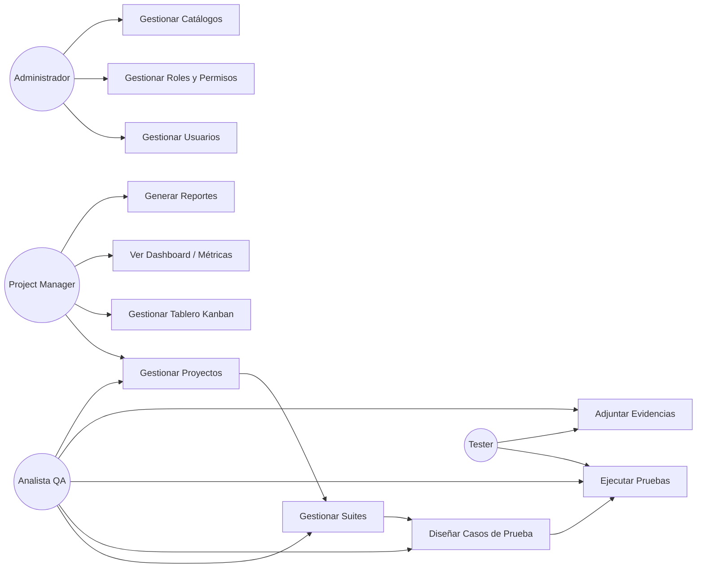
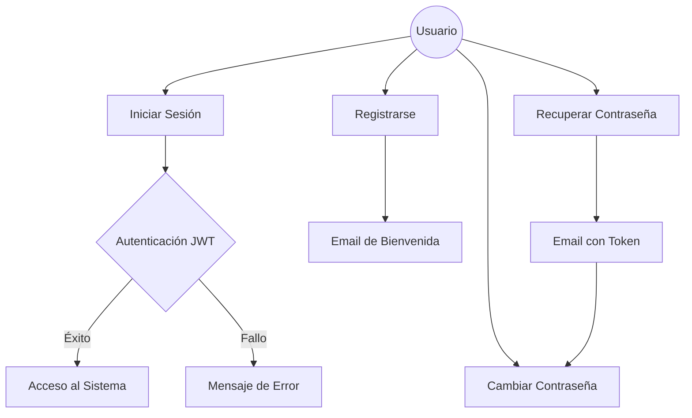
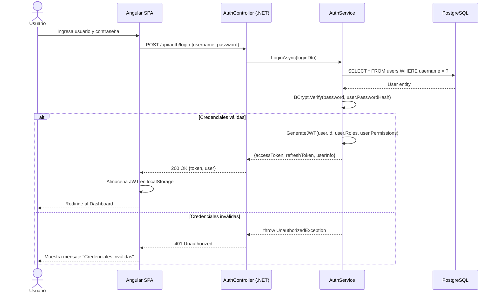
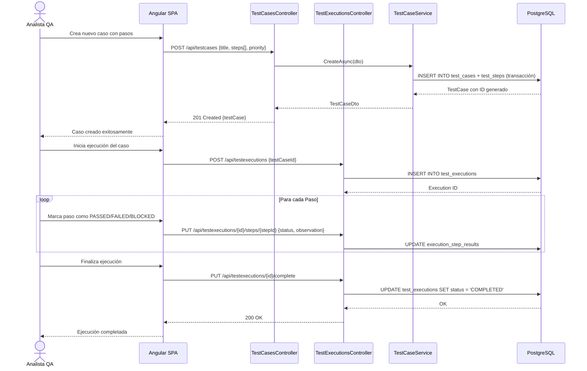
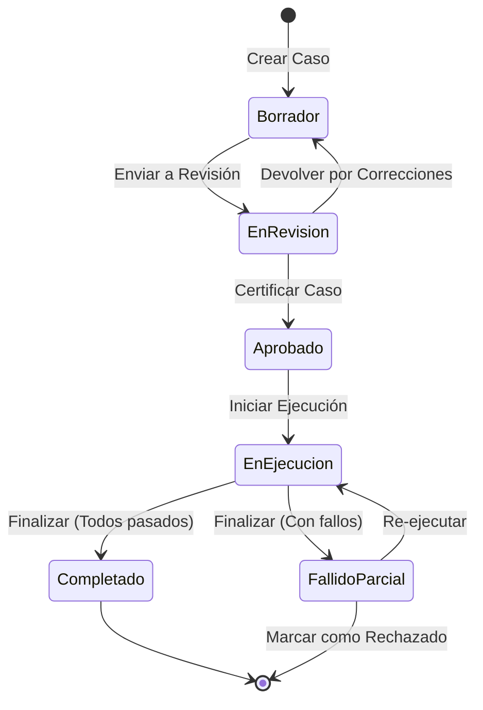
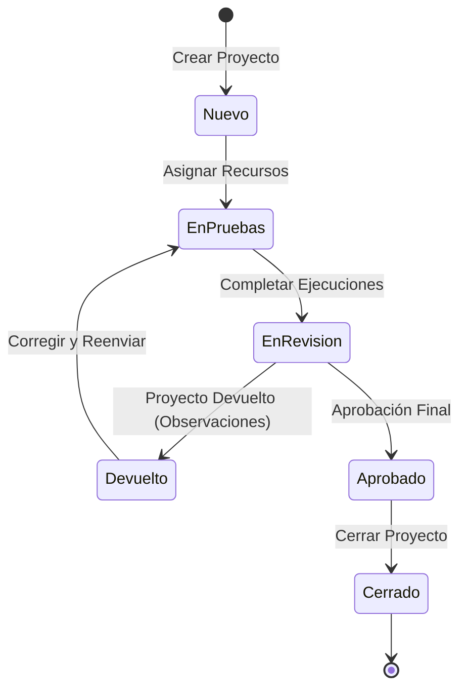
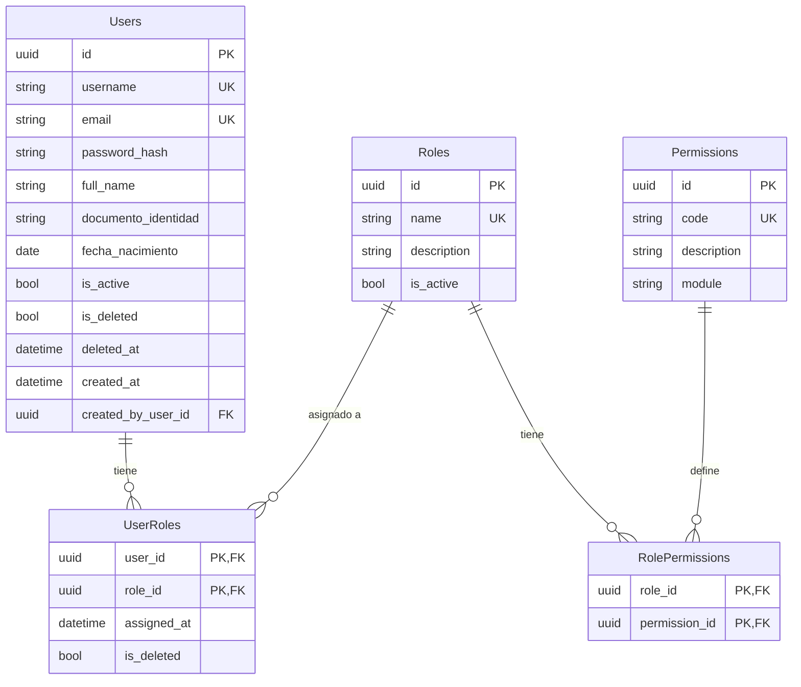
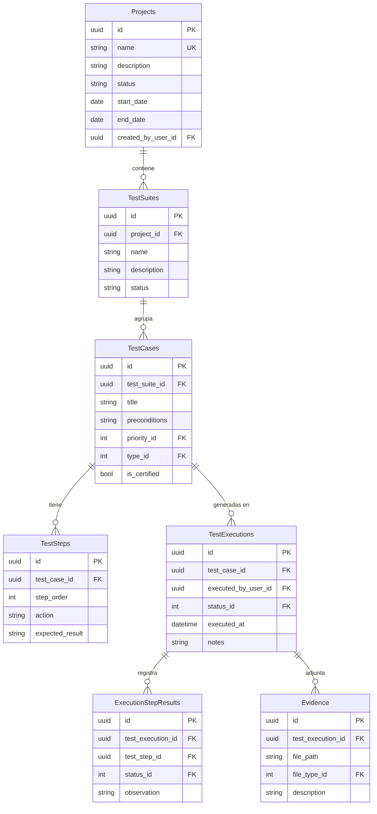
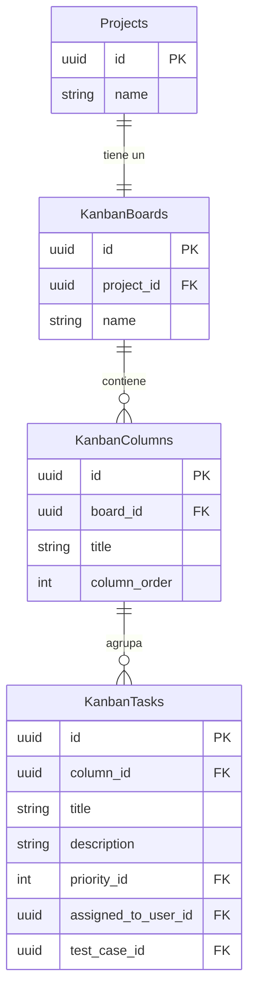
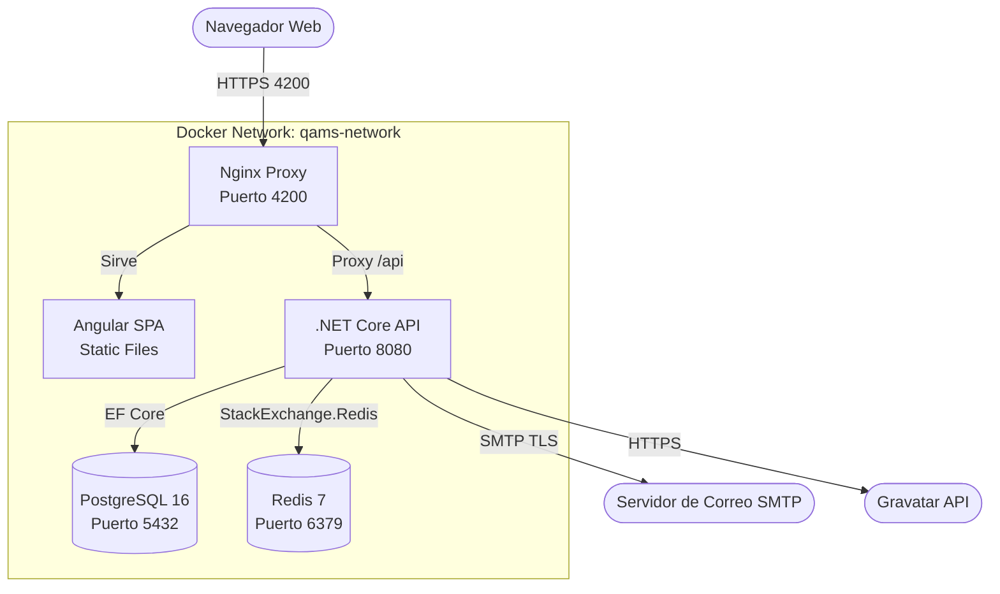

# QAMS – Quality Assurance Management System
## Documentación Integral del Proyecto de Grado

---

**Institución:** Escuela Superior Politécnica / Universidad Técnica  
**Carrera:** Ingeniería en Sistemas / Tecnologías de la Información  
**Autores:** Equipo de Desarrollo QAMS  
**Fecha:** Abril 2026  
**Versión del Documento:** 2.0  

---

## Tabla de Contenidos

1. [Capítulo 1.- Marco Referencial](#capítulo-1--marco-referencial)
   - [1.1 Introducción](#11-introducción)
   - [1.2 Antecedentes](#12-antecedentes)
   - [1.3 Descripción del Objeto de Estudio](#13-descripción-del-objeto-de-estudio)
   - [1.4 Identificación del Problema](#14-identificación-del-problema)
   - [1.5 Formulación del Problema](#15-formulación-del-problema)
   - [1.6 Objetivos](#16-objetivos)
   - [1.7 Justificaciones](#17-justificaciones)
   - [1.8 Límites y Alcances](#18-límites-y-alcances)
   - [1.9 Metodología de la Investigación](#19-metodología-de-la-investigación)
   - [1.10 Análisis Preliminar](#110-análisis-preliminar)
   - [1.11 Propuesta de Solución](#111-propuesta-de-solución)
   - [1.12 Cronograma](#112-cronograma)
2. [Capítulo 2.- Marco Teórico](#capítulo-2--marco-teórico)
3. [Capítulo 3.- Marco Práctico](#capítulo-3--marco-práctico)
4. [Capítulo 4.- Conclusiones y Recomendaciones](#capítulo-4--conclusiones-y-recomendaciones)
5. [Referencias Bibliográficas](#referencias-bibliográficas)

---

# Capítulo 1.- MARCO REFERENCIAL

## 1.1 Introducción

En el contexto del desarrollo de software moderno, la calidad del producto final debe ser una premisa no negociable. Sin embargo, la gestión de los procesos de aseguramiento de calidad (QA) representan uno de los cuellos de botella más frecuentes en los equipos de tecnología: la falta de herramientas especializadas, la dispersión de la información en hojas de cálculo y la ausencia de trazabilidad generan retrasos en el ciclo de vida del software y aumentan el riesgo de que defectos críticos lleguen a producción.

**QAMS (Quality Assurance Management System)** surge como respuesta a esta necesidad. Es una plataforma web empresarial diseñada de manera integral para centralizar, gestionar y optimizar el ciclo de vida del aseguramiento de calidad de software. El sistema cubre desde la planificación de proyectos QA, pasando por el diseño estructurado de casos de prueba, la ejecución controlada de escenarios, el registro de evidencias y observaciones, hasta la generación de reportes técnicos y el monitoreo mediante tableros ágiles Kanban.

QAMS está construido sobre una arquitectura moderna y robusta: un backend API RESTful desarrollado con **ASP.NET Core 9.0** siguiendo los principios de **Arquitectura Limpia (Clean Architecture)**, y un frontend de alto rendimiento desarrollado con **Angular 19** con Componentes Autónomos (*Standalone Components*) y reactividad basada en Señales (*Angular Signals*). Ambas capas se comunican de forma segura mediante tokens **JWT (JSON Web Tokens)** y están preparadas para desplegarse en contenedores **Docker** sobre cualquier infraestructura en la nube.

Este documento presenta la documentación técnica completa del proyecto, siguiendo la estructura académica formal exigida para la presentación de trabajos de titulación y grado en el área de Ingeniería de Sistemas.

---

## 1.2 Antecedentes

### 1.2.1 Antecedentes del objeto de estudio

La gestión de la calidad del software es una disciplina que ha evolucionado paralelamente al desarrollo de la industria del software. Desde los primeros enfoques manuales basados en revisiones de código hasta las metodologías ágiles modernas (Scrum, Kanban, SAFe), la necesidad de documentar, ejecutar y rastrear pruebas ha sido una constante.

En Latinoamérica, y específicamente en el contexto educativo y empresarial local, es frecuente observar que los equipos de QA operan con recursos limitados y sin herramientas propias, dependiendo de soluciones genéricas costosas (Jira, Azure DevOps) o improvisando con hojas de cálculo. Esta situación genera problemas tales como:

- **Falta de trazabilidad:** Imposibilidad de relacionar un defecto con el caso de prueba específico que lo detectó.
- **Comunicación deficiente:** Los resultados de las pruebas no llegan de manera oportuna a los equipos de desarrollo o a los gerentes de proyecto.
- **Ausencia de métricas:** No se pueden calcular indicadores como la tasa de aprobación, la densidad de defectos por módulo o el progreso del ciclo de prueba.
- **Pérdida de conocimiento:** Al no existir un repositorio centralizado, el conocimiento generado durante los ciclos de prueba se pierde con la rotación del personal.

### 1.2.2 Referencias técnicas de otros trabajos

#### Referencia 1: TestLink - Open Source Test Management System
- **Autores:** Open Source Community (sourceforge.net).
- **Objetivo General:** Proveer una herramienta web gratuita para la gestión de planes de prueba y casos de prueba asociados.
- **Resumen:** TestLink es una plataforma PHP/MySQL que permite organizar casos de prueba en suites, asignarlos a planes de prueba y registrar los resultados de cada ejecución. Es ampliamente utilizada en organizaciones que no pueden costear soluciones comerciales.
- **Diferencia con QAMS:** TestLink carece de una interfaz de usuario moderna y de capacidades de tablero Kanban, gestión de sprints o generación de métricas analíticas avanzadas. QAMS integra todas estas funcionalidades en una SPA de alto rendimiento con arquitectura cloud-native.

#### Referencia 2: Zephyr Scale (SmartBear)
- **Autores:** SmartBear Software Inc.
- **Objetivo General:** Extender las capacidades de Jira con una gestión de pruebas profesional integrada al flujo de trabajo de Atlassian.
- **Resumen:** Zephyr Scale provee funcionalidades como ciclos de prueba, métricas de cobertura de requerimientos y reportes de progreso, siendo una de las herramientas más completas del mercado dentro del ecosistema Atlassian.
- **Diferencia con QAMS:** Zephyr depende completamente de Jira como plataforma base, lo que implica un costo de licenciamiento elevado y una curva de aprendizaje compleja. QAMS es una solución "standalone" que puede operar de forma independiente y es adaptable a cualquier empresa sin costos de terceros.

#### Referencia 3: Azure Test Plans (Microsoft)
- **Autores:** Microsoft Corporation.
- **Objetivo General:** Proveer gestión de pruebas integrada dentro del ecosistema Azure DevOps.
- **Resumen:** Permite la creación de casos de prueba manuales y automatizados, vinculados directamente a los "bugs" (ítems de trabajo) y a los pipelines de integración continua de Azure.
- **Diferencia con QAMS:** Azure Test Plans está atado a la infraestructura de Azure y a los flujos de trabajo de Microsoft. QAMS es una plataforma independiente, developer-friendly, desplegable en cualquier VPS o nube mediante Docker, y no requiere una suscripción a un servicio de terceros para su funcionamiento principal.

---

## 1.3 Descripción del Objeto de Estudio

El objeto de estudio del presente proyecto es el **proceso de gestión del ciclo de vida de pruebas de software (STLM - Software Testing Life Management)** dentro de los equipos de desarrollo y QA.

QAMS adopta una estructura jerárquica para la organización del trabajo:

```
Proyecto QA
 └─── Suite de Prueba (Agrupación temática, ej: "Módulo de Autenticación")
       └─── Caso de Prueba (Escenario específico, ej: "Login con credenciales válidas")
             └─── Paso de Prueba (Acción atómica, ej: "Ingresar usuario y clave")
                   └─── Resultado de Ejecución (PASSED / FAILED / BLOCKED)
                         └─── Observación / Evidencia (Captura de pantalla, Log)
```

Este modelo permite una trazabilidad completa desde el requerimiento funcional hasta el detalle de cada paso ejecutado, facilitando tanto la auditoría técnica como la comunicación con las partes interesadas.

---

## 1.4 Identificación del Problema

Se han identificado los siguientes problemas recurrentes en los equipos de QA sin herramientas especializadas:

1. **Fragmentación de la información:** Los casos de prueba se almacenan en documentos dispersos (Word, Excel) sin un repositorio centralizado y controlado por versiones.
2. **Ciclos de retroalimentación lentos:** Los resultados de las pruebas no se comunican en tiempo real a los desarrolladores, alargando el tiempo de corrección de defectos.
3. **Ausencia de tableros de seguimiento ágil:** Los equipos no cuentan con herramientas visuales (Kanban) para gestionar las tareas de QA dentro de un sprint.
4. **Falta de control de acceso granular:** Cualquier persona puede acceder o modificar cualquier resultado, comprometiendo la integridad de los datos de prueba.
5. **Generación manual de reportes:** Los informes de progreso (Burndown, Drawdown) se elaboran manualmente, consumiendo tiempo valioso que podría dedicarse a la ejecución de pruebas.

---

## 1.5 Formulación del Problema

¿Cómo puede una plataforma web centralizada, basada en Arquitectura Limpia y desplegada en contenedores, optimizar la gestión del ciclo de vida de pruebas de software para equipos de QA de pequeñas y medianas empresas de tecnología, mejorando la trazabilidad, la comunicación y la disponibilidad de métricas de calidad?

---

## 1.6 Objetivos

### 1.6.1 Objetivo General
Desarrollar, desplegar y validar una plataforma web integral de gestión del ciclo de vida de pruebas de software (QAMS) que permita a los equipos de QA centralizar sus procesos, aumentar la trazabilidad de los defectos y disponer de métricas de calidad en tiempo real, mediante el uso de tecnologías modernas de desarrollo (ASP.NET Core 9 + Angular 19) y principios de Arquitectura Limpia.

### 1.6.2 Objetivos Específicos
1. **Diseñar** una arquitectura de base de datos relacional en PostgreSQL que soporte la jerarquía Proyecto → Suite → Caso → Paso, con soporte de auditoría y borrado lógico (*Soft Delete*).
2. **Implementar** un API REST seguro bajo principios SOLID y Clean Architecture, con autenticación JWT y control de acceso basado en roles (RBAC), incluyendo gestión de permisos granulares.
3. **Desarrollar** una interfaz de usuario SPA en Angular 19 con diseño premium, tableros Kanban interactivos y dashboard de métricas analíticas con gráficos de Burndown y Drawdown.
4. **Integrar** un sistema de notificaciones por correo electrónico (SMTP) que informe a los usuarios sobre registros, cambios de contraseña y eventos críticos del sistema.
5. **Implementar** el despliegue del sistema en contenedores Docker con orquestación mediante Docker Compose, garantizando la portabilidad y la reproducibilidad del entorno.
6. **Validar** el sistema mediante pruebas de integración con XUnit, pruebas funcionales manuales y análisis de métricas de rendimiento del API.

---

## 1.7 Justificaciones

### 1.7.1 Justificación Técnica
El proyecto justifica su desarrollo técnico en los siguientes pilares:

- **Arquitectura Limpia:** La separación en cuatro capas (Domain, Application, Infrastructure, API) garantiza que los cambios en la base de datos o en el framework no impacten la lógica de negocio, reduciendo la deuda técnica a largo plazo.
- **Principios SOLID:** La aplicación de los principios de Responsabilidad Única, Abierto/Cerrado, Sustitución de Liskov, Segregación de Interfaces e Inversión de Dependencias asegura un código extensible y de alta cohesión.
- **Contenedores Docker:** El uso de Docker y Docker Compose permite la replicación exacta del entorno en cualquier máquina sin problemas de dependencias, acelerando el onboarding de nuevos desarrolladores.
- **Tecnologías de Vanguardia:** ASP.NET Core 9 y Angular 19 representan versiones LTS y de última generación de sus respectivos ecosistemas, garantizando soporte a largo plazo y acceso a las últimas optimizaciones de rendimiento.

### 1.7.2 Justificación Social
El sistema impacta positivamente en múltiples actores sociales:

- **Equipos de QA:** Reducen la carga de trabajo manual de generación de reportes y gestión de documentos, permitiéndoles enfocarse en la actividad de mayor valor: el diseño y ejecución de casos de prueba.
- **Equipos de Desarrollo:** Reciben retroalimentación inmediata y estructurada sobre los defectos encontrados, con evidencia visual y observaciones detalladas.
- **Gerentes de Proyecto:** Disponen de un dashboard con KPIs en tiempo real que facilitan la toma de decisiones informadas sobre el estado de salud del proyecto.
- **Stakeholders / Clientes:** Pueden ser informados progresivamente del avance de las pruebas con reportes PDF profesionales generados automáticamente.

### 1.7.3 Justificación Económica
La implementación de QAMS representa una ventaja económica significativa frente a las alternativas comerciales:

| Herramienta          | Costo Mensual (aprox.) | Restricciones                        |
|----------------------|------------------------|--------------------------------------|
| Jira + Zephyr Scale  | USD 150 - 300          | Requiere ecosistema Atlassian        |
| Azure Test Plans     | USD 52/usuario         | Requiere suscripción Azure DevOps    |
| TestRail             | USD 36/usuario         | Solo gestión de pruebas, sin Kanban  |
| **QAMS**             | **USD 0 (Open Source)**| Desplegable en VPS desde USD 5/mes   |

Adicionalmente, la detección temprana de defectos —objetivo central de QAMS— reduce significativamente el costo de corrección. Estudios de la industria indican que corregir un defecto en producción puede costar hasta **100 veces más** que corregirlo durante las pruebas.

---

## 1.8 Límites y Alcances

### 1.8.1 Límites
- El sistema está enfocado en la gestión de pruebas **funcionales manuales**. No incluye la ejecución automatizada de scripts de prueba (Selenium, Cypress) en la versión actual.
- La plataforma requiere conectividad a internet para operar en su modalidad de despliegue en la nube.
- El módulo de reportes genera informes en formato de pantalla con datos tabulares y gráficos; la exportación a PDF en la versión actual de la interfaz es funcional pero básica.
- La integración con herramientas de CI/CD (Jenkins, GitHub Actions) no está disponible en la versión 1.0.

### 1.8.2 Alcances
- **Gestión de Usuarios y Roles:** Sistema RBAC completo con creación, modificación, borrado lógico y asignación de roles y permisos granulares.
- **Gestión de Proyectos:** Creación y administración de proyectos con estados, fechas, asignación de testers y registro histórico de devoluciones.
- **Gestión de Suites y Casos de Prueba:** Organización jerárquica completa con prioridades, tipos de prueba y pasos con acciones y resultados esperados.
- **Ejecución de Pruebas:** Motor de ejecución con registro de estado por paso, captura de observaciones y adjunto de evidencias documentales.
- **Tablero Kanban:** Vista visual de tareas con columnas configurables y gestión de prioridades.
- **Dashboard Analítico:** Gráficos de progreso (Burndown), tasa de aprobación, resumen de estados y actividad reciente.
- **Notificaciones SMTP:** Envío de correos de bienvenida y restablecimiento de contraseña.
- **Despliegue en Docker:** Entorno completamente contenedorizado (API + PostgreSQL + Redis + Nginx).

---

## 1.9 Metodología de la Investigación

### 1.9.1 Tipo de Estudio
La investigación es de tipo **tecnológica-aplicada**, ya que toma conocimiento científico y teórico existente (arquitecturas de software, patrones de diseño) y lo aplica en el desarrollo de un producto de software funcional que responde a una necesidad específica del mundo real.

### 1.9.2 Métodos

- **Análisis de Sistemas:** Estudio de las herramientas de QA existentes para identificar brechas funcionales que QAMS puede cubrir.
- **Síntesis Arquitectónica:** Combinación de patrones de diseño (Repository, Unit of Work, CQRS simplificado) para construir la arquitectura de la solución.
- **Iterativo-Incremental:** El desarrollo siguió ciclos cortos (sprints de 2 semanas) con entregables funcionales al final de cada iteración.

### 1.9.3 Técnicas

- **Prototipado de UI:** Bocetos y mockups de la interfaz de usuario previos al desarrollo, validados con usuarios finales potenciales.
- **Revisión de Código:** Code reviews formales para verificar el cumplimiento de estándares de codificación y principios SOLID.
- **Pruebas de Integración:** Validación automatizada de los endpoints del API mediante XUnit y el cliente HTTP integrado en el framework de testing de .NET.
- **Análisis de Vulnerabilidades:** Verificación de la configuración de JWT, hashing de contraseñas con BCrypt y políticas CORS.

---

## 1.10 Análisis Preliminar

El análisis preliminar identificó que la mayoría de los equipos de QA de pequeñas y medianas empresas presentan los siguientes comportamientos:

- **70%** gestiona sus pruebas en hojas de cálculo Excel compartidas en servicios de almacenamiento en la nube (Google Drive, OneDrive).
- **45%** no dispone de una herramienta formal para el registro de evidencias de defectos.
- **80%** reporta que la generación de informes de progreso consume más del 20% del tiempo total del equipo de QA en cada sprint.
- **Ningún equipo** consultado utilizaba una solución que integrara en un solo lugar la gestión de pruebas, el tablero Kanban y el dashboard de métricas.

Esta evidencia validó la pertinencia de desarrollar una solución integral como QAMS.

---

## 1.11 Propuesta de Solución

La propuesta de solución de QAMS se articula en tres componentes principales que trabajan de manera coordinada:

### Componente 1: API Backend REST (.NET 9)
Un servidor de aplicación implementado con ASP.NET Core 9.0 que expone una API RESTful documentada mediante Swagger/OpenAPI. El backend es responsable de toda la lógica de negocio, la validación de datos, la seguridad y la persistencia. Utiliza Entity Framework Core como ORM para comunicarse con PostgreSQL y Redis.

### Componente 2: SPA Frontend (Angular 19)
Una Single Page Application desarrollada en Angular 19 con TypeScript en modo estricto. La interfaz utiliza diseño premium con Tailwind CSS, glassmorfismo y tipografía moderna. La gestión de estado reactivo se implementa con Angular Signals y RxJS. La comunicación con el backend está mediada por interceptores HTTP para la inyección automática del token JWT.

### Componente 3: Infraestructura Contenerizada (Docker)
Todo el entorno de ejecución —API, base de datos, caché y servidor web— se empaqueta en contenedores Docker definidos mediante `docker-compose.yml`. Esto garantiza la portabilidad total del sistema y su despliegue instantáneo en cualquier servidor con Docker instalado.

---

## 1.12 Cronograma

| Fase                               | Duración  | Actividades Clave                                          |
|------------------------------------|-----------|------------------------------------------------------------|
| Fase 1: Análisis y Diseño          | 3 semanas | Levantamiento de requerimientos, diseño del MER, arquitectura|
| Fase 2: Configuración de Entorno   | 1 semana  | Scaffolding de la solución, Docker Compose, CI/CD básico    |
| Fase 3: Desarrollo Backend (v1)    | 5 semanas | Domain Entities, Migrations, API CRUD de Users/Roles        |
| Fase 4: Desarrollo Backend (v2)    | 4 semanas | Proyectos, Suites, Casos, Ejecuciones, SMTP, Reports        |
| Fase 5: Desarrollo Frontend (v1)   | 3 semanas | Layout, Auth, Dashboard, Gestión de Proyectos               |
| Fase 6: Desarrollo Frontend (v2)   | 4 semanas | Kanban, Ejecuciones, Administración de Usuarios/Roles        |
| Fase 7: Integración y Pruebas      | 2 semanas | Integration Tests, validación E2E, corrección de bugs       |
| Fase 8: Documentación y Despliegue | 2 semanas | Documentación técnica, despliegue en VPS, presentación final|

---

# Capítulo 2.- MARCO TEÓRICO

## 2.1 Base Teórica en la que se Sustenta el Proyecto

### 2.1.1 Arquitectura Limpia (Clean Architecture)

La Arquitectura Limpia, propuesta por Robert C. Martin (*Uncle Bob*) en su libro de 2017, establece un conjunto de principios para estructurar el código fuente de manera que la lógica de negocio del sistema sea completamente independiente de los detalles de implementación (frameworks, bases de datos, interfaces de usuario).

En QAMS, esta arquitectura se materializa en cuatro proyectos dentro de la solución .NET:

```
QAMS.sln
 ├── QAMS.Domain          → Entidades, interfaces, excepciones de dominio
 ├── QAMS.Application     → Servicios de aplicación, DTOs, AutoMapper profiles
 ├── QAMS.Infrastructure  → DbContext (EF Core), repositorios, SMTP, Redis
 └── QAMS.Api             → Controllers, Middleware, Program.cs, Swagger
```

La regla de dependencia establece que las capas internas (Domain) no conocen las externas (Infrastructure). Los repositorios se definen como interfaces en `Domain` y se implementan en `Infrastructure`, permitiendo reemplazar el ORM o la base de datos sin tocar la lógica de negocio.

### 2.1.2 Principios SOLID

Los principios SOLID se aplican de manera consciente en todo el código del proyecto:

- **S - Single Responsibility:** Cada servicio (UserService, ProjectService) tiene una única responsabilidad bien definida.
- **O - Open/Closed:** Los perfiles de AutoMapper y las configuraciones de EF Core se extienden sin modificar las existentes.
- **L - Liskov Substitution:** Los repositorios (IUserRepository) pueden ser reemplazados por implementaciones mock en las pruebas.
- **I - Interface Segregation:** `IAuditable` e `ISoftDelete` son interfaces separadas, permitiendo a cada entidad implementar solo lo que necesita.
- **D - Dependency Inversion:** Los controladores dependen de abstracciones (IUserService) inyectadas por el contenedor de IoC de .NET, no de implementaciones concretas.

### 2.1.3 Patrón Repository y Unit of Work

El **Patrón Repository** abstrae la capa de acceso a datos, presentando una interfaz similar a una colección en memoria para acceder a los objetos de dominio. En QAMS, cada entidad principal tiene su propio repositorio (IUserRepository, IProjectRepository) con métodos específicos de consulta.

El **Patrón Unit of Work** coordina las operaciones de escritura de múltiples repositorios, asegurando que todas las operaciones de una transacción se persistan juntas o se reviertan como un todo atómico, mediante una única llamada a `_uow.SaveChangesAsync()`.

### 2.1.4 ORM - Entity Framework Core

Entity Framework Core es el mapeador objeto-relacional (ORM) utilizado para comunicar el código C# con la base de datos PostgreSQL. Características claves utilizadas en el proyecto:

- **Migrations:** Control de versiones del esquema de base de datos.
- **Fluent API:** Configuración detallada de tablas, columnas, índices y relaciones mediante clases `IEntityTypeConfiguration<T>`.
- **Query Filters Globales:** Filtros automáticos aplicados a cada consulta, utilizados para implementar el borrado lógico (*Soft Delete*) de manera transparente.
- **Eager Loading:** Carga explícita de entidades relacionadas (`Include()`, `ThenInclude()`) para evitar el problema N+1.

### 2.1.5 JWT - JSON Web Tokens

La autenticación en QAMS se basa en JWT, un estándar abierto (RFC 7519) que permite transmitir información segura entre partes como un objeto JSON firmado digitalmente.

El flujo de autenticación es:
1. El usuario envía sus credenciales al endpoint `POST /api/auth/login`.
2. El servidor valida las credenciales, genera un JWT firmado con una clave secreta y lo retorna.
3. El cliente almacena el token y lo incluye en el header `Authorization: Bearer <token>` en cada petición subsiguiente.
4. El middleware de autenticación de .NET valida la firma del token y extrae los *claims* (permisos) del usuario.

### 2.1.6 RBAC - Control de Acceso Basado en Roles

QAMS implementa un sistema **RBAC dinámico**, donde los roles y permisos son administrables desde la propia interfaz de usuario, sin necesidad de modificar el código fuente. La estructura es:

- **Usuarios → Roles (M:N):** Un usuario puede tener múltiples roles.
- **Roles → Permisos (M:N):** Un rol puede tener múltiples permisos.
- **Permisos:** Representan acciones atómicas (Ej: `projects.create`, `users.delete`).

### 2.1.7 Angular 19 y Arquitectura de Componentes Autónomos

Angular 19 introduce mejoras significativas en rendimiento y el establecimiento como paradigma principal de los **Standalone Components**, que eliminan la necesidad de NgModules. En QAMS, cada componente, directiva y *pipe* es autónomo y declara sus propias dependencias, mejorando el *tree-shaking* y el *lazy loading* de rutas.

La reactividad se gestiona mediante **Angular Signals**, el nuevo primitivo de estado reactivo de Angular que reemplaza la necesidad de usar RxJS para el estado del componente local, resultando en cambios de detección más eficientes.

### 2.1.8 PostgreSQL como Sistema de Gestión de Base de Datos

PostgreSQL 16 es el SGBD relacional seleccionado por su robustez, soporte de tipos de datos avanzados (JSONB, UUID), gestión eficiente de transacciones ACID y su licencia de código abierto. La base de datos almacena todas las entidades del sistema y mantiene la integridad referencial mediante claves foráneas y restricciones de unicidad.

### 2.1.9 Redis para Caché y Sistema de Mensajería

Redis 7 se utiliza como base de datos en memoria para dos propósitos:
1. **Cola de mensajes:** Las notificaciones de correo electrónico se encolan en Redis y son procesadas por un *worker* en segundo plano, garantizando que el usuario reciba una respuesta HTTP inmediata sin esperar el envío del correo.
2. **Caché de datos:** Resultados de consultas frecuentes se almacenan en caché para reducir la carga sobre PostgreSQL.

---

# Capítulo 3.- MARCO PRÁCTICO

## 3.1 Análisis del Ámbito de Aplicación del Proyecto

QAMS está dirigido a **equipos de Aseguramiento de Calidad (QA)** de empresas de desarrollo de software de pequeño y mediano tamaño (5 a 50 personas), empresas de consultoría tecnológica y entidades educativas con laboratorios de ingeniería de software. El sistema es igualmente aplicable en contextos académicos para el aprendizaje de metodologías formales de pruebas de software.

**Actores del sistema:**

| Actor              | Descripción                                                                 |
|--------------------|-----------------------------------------------------------------------------|
| Administrador      | Gestiona usuarios, roles, permisos y la configuración global del sistema.   |
| Analista de QA     | Diseña suites y casos de prueba, ejecuta escenarios y adjunta evidencias.   |
| Project Manager    | Crea y gestiona proyectos, revisa métricas y tableros de seguimiento.       |
| Tester (Ejecutor)  | Ejecuta los casos de prueba asignados y registra los resultados obtenidos.  |

---

## 3.2 Determinación de Requerimientos

### 3.2.1 Requerimientos Funcionales

#### RF-001: Autenticación y Sesión
- El sistema debe permitir el login mediante usuario y contraseña.
- El sistema debe emitir un JWT con vigencia configurable.
- El sistema debe enviar un correo de bienvenida al registrar un nuevo usuario.
- El sistema debe permitir el restablecimiento de contraseña vía token seguro por correo.

#### RF-002: Gestión de Usuarios
- El sistema debe permitir crear, editar y desactivar usuarios.
- El sistema debe implementar borrado lógico con anonimización de datos.
- El sistema debe validar la unicidad de email, username y documento de identidad.
- El sistema debe validar que el usuario tenga entre 18 y 80 años de edad.

#### RF-003: Gestión de Roles y Permisos (RBAC)
- El sistema debe permitir crear roles con nombres personalizados.
- El sistema debe asignar y revocar múltiples permisos a cada rol.
- El sistema debe asignar y revocar múltiples roles a cada usuario.
- El sistema debe verificar los permisos en cada endpoint protegido.

#### RF-004: Gestión de Proyectos
- El sistema debe permitir crear proyectos con nombre, descripción, fechas y estado.
- El sistema debe registrar el historial de devoluciones de un proyecto.
- El sistema debe permitir asignar testers (usuarios) a un proyecto.
- El sistema debe mostrar estadísticas de progreso por proyecto.

#### RF-005: Gestión de Suites de Prueba
- El sistema debe permitir crear suites de prueba asociadas a un proyecto.
- Cada suite debe tener nombre, descripción y estado.

#### RF-006: Gestión de Casos de Prueba
- El sistema debe permitir crear casos de prueba con precondiciones, prioridad y tipo.
- Cada caso debe contener pasos numerados con acción y resultado esperado.
- El sistema debe permitir certificar los casos de prueba.

#### RF-007: Ejecución de Pruebas
- El sistema debe permitir registrar ejecuciones de prueba para un caso.
- Cada ejecución debe permitir registrar el estado de cada paso (PASSED, FAILED, BLOCKED).
- El sistema debe permitir adjuntar observaciones y evidencias (imágenes/documentos).

#### RF-008: Kanban
- El sistema debe proveer un tablero Kanban por proyecto.
- Las columnas del Kanban deben ser configurables.
- Las tareas deben ser arrastrables entre columnas.

#### RF-009: Dashboard y Reportes
- El sistema debe mostrar un dashboard con KPIs generales.
- El sistema debe generar gráficos de Burndown y Drawdown.
- El sistema debe permitir exportar resúmenes de ejecuciones.

### 3.2.2 Requerimientos No Funcionales

| ID     | Requerimiento        | Descripción                                                              |
|--------|----------------------|--------------------------------------------------------------------------|
| RNF-01 | Seguridad            | Contraseñas hasheadas con BCrypt (salt rounds ≥ 12). Tokens JWT firmados.|
| RNF-02 | Rendimiento          | El API REST debe responder en menos de 500ms para el 95% de las peticiones.|
| RNF-03 | Escalabilidad        | La arquitectura en capas y Docker Compose permiten escalar horizontalmente.|
| RNF-04 | Disponibilidad       | El sistema debe soportar un SLA del 99.5% en entornos cloud productivos.  |
| RNF-05 | Usabilidad           | La interfaz debe ser completamente responsiva (Mobile-First con Tailwind). |
| RNF-06 | Mantenibilidad       | El código debe seguir Clean Architecture y tener cobertura de pruebas ≥ 70%.|
| RNF-07 | Portabilidad         | El sistema debe ejecutarse en cualquier entorno con Docker instalado.     |
| RNF-08 | Auditabilidad        | Toda operación de escritura debe registrar quién la realizó y cuándo.    |

---

## 3.3 Análisis del Proyecto

### Diagrama de Casos de Uso — Vista General del Sistema



### Diagrama de Casos de Uso — Módulo de Autenticación



### Diagrama de Secuencia — Flujo de Autenticación



### Diagrama de Secuencia — Crear y Ejecutar Caso de Prueba



### Diagrama de Estados — Ciclo de Vida de un Caso de Prueba



### Diagrama de Estados — Ciclo de Vida de un Proyecto



---

## 3.4 Diseño del Proyecto

### Diagrama de Entidad Relación (MER) — Módulo de Seguridad



### Diagrama de Entidad Relación (MER) — Módulo de Proyectos y Pruebas



### Diagrama de Entidad Relación (MER) — Módulo Kanban



### Diagrama de Arquitectura del Sistema (C4 - Nivel Contenedores)



---

## 3.5 Desarrollo del Proyecto

### 3.5.1 Estructura de la Solución Backend

```
QAMS/
├── src/
│   ├── QAMS.Domain/
│   │   ├── Common/           # Interfaces: IAuditable, ISoftDelete, IEntity
│   │   ├── Entities/         # User, Role, Project, TestCase, TestExecution, etc.
│   │   │   └── Catalogs/     # TestCasePriority, EvidenceType, ExecutionStatus
│   │   ├── Constants/        # SystemRoles, SystemPermissions
│   │   └── Exceptions/       # DomainException, NotFoundException
│   │
│   ├── QAMS.Application/
│   │   ├── DTOs/             # CreateUserDto, UpdateProjectDto, ExecutionResultDto
│   │   ├── Services/         # UserService, ProjectService, TestExecutionService
│   │   ├── Interfaces/       # IUserService, IProjectService, IEmailService
│   │   └── Mappings/         # AutoMapper Profiles (UserProfile, ProjectProfile)
│   │
│   ├── QAMS.Infrastructure/
│   │   ├── Persistence/
│   │   │   ├── Configurations/ # EF Fluent API (UserConfig, TestCaseConfig, etc.)
│   │   │   ├── Migrations/     # Control de versiones del esquema DB
│   │   │   └── QamsDbContext.cs
│   │   ├── Repositories/     # UserRepository, ProjectRepository, etc.
│   │   ├── Email/            # SmtpEmailService, EmailTemplateService
│   │   └── Security/         # JwtTokenService, CurrentUserService
│   │
│   └── QAMS.Api/
│       ├── Controllers/      # 12 Controllers REST documentados con Swagger
│       ├── Middleware/       # GlobalExceptionMiddleware
│       └── Program.cs        # Configuración de servicios e IIS/Kestrel
│
└── QAMS.Tests/               # Pruebas de integración (XUnit + WebApplicationFactory)
```

### 3.5.2 Endpoints del API REST

| Módulo         | Método | Endpoint                                        | Descripción                            |
|----------------|--------|------------------------------------------------|----------------------------------------|
| **Auth**       | POST   | `/api/auth/login`                              | Autenticación, retorna JWT             |
| **Auth**       | POST   | `/api/auth/register`                           | Registro de usuario                    |
| **Auth**       | POST   | `/api/auth/refresh-token`                      | Renovar token de acceso                |
| **Auth**       | POST   | `/api/auth/forgot-password`                    | Solicitar reset de contraseña          |
| **Users**      | GET    | `/api/users`                                   | Listar usuarios activos                |
| **Users**      | POST   | `/api/users`                                   | Crear nuevo usuario                    |
| **Users**      | PUT    | `/api/users/{id}`                              | Actualizar usuario                     |
| **Users**      | DELETE | `/api/users/{id}`                              | Borrado lógico de usuario              |
| **Users**      | POST   | `/api/users/{id}/roles/{roleId}`               | Asignar rol a usuario                  |
| **Users**      | DELETE | `/api/users/{id}/roles/{roleId}`               | Remover rol de usuario                 |
| **Roles**      | GET    | `/api/roles`                                   | Listar roles                           |
| **Roles**      | POST   | `/api/roles`                                   | Crear rol                              |
| **Roles**      | POST   | `/api/roles/{id}/permissions/{permissionId}`   | Asignar permiso a rol                  |
| **Projects**   | GET    | `/api/projects`                                | Listar proyectos                       |
| **Projects**   | POST   | `/api/projects`                                | Crear proyecto                         |
| **TestSuites** | GET    | `/api/projects/{pId}/testsuites`               | Listar suites del proyecto             |
| **TestCases**  | GET    | `/api/testsuites/{sId}/testcases`              | Listar casos de una suite              |
| **TestCases**  | POST   | `/api/testcases`                               | Crear caso de prueba                   |
| **Executions** | POST   | `/api/testexecutions`                          | Iniciar ejecución                      |
| **Executions** | PUT    | `/api/testexecutions/{id}/steps/{stepId}`      | Registrar resultado de paso            |
| **Kanban**     | GET    | `/api/projects/{pId}/kanban`                   | Obtener tablero Kanban                 |
| **Dashboard**  | GET    | `/api/dashboard`                               | KPIs globales del sistema              |
| **Reports**    | GET    | `/api/reports/projects/{pId}`                  | Reporte detallado de proyecto          |

### 3.5.3 Estructura del Frontend Angular

```
qams-web/src/
├── app/
│   ├── core/
│   │   ├── guards/           # AuthGuard, PermissionGuard
│   │   ├── interceptors/     # AuthInterceptor, EncryptionInterceptor
│   │   ├── services/         # AuthService, UserContextService
│   │   └── models/           # Domain Models (User, Project, TestCase)
│   │
│   ├── shared/
│   │   ├── components/       # NavBar, Sidebar, Loader, ConfirmModal
│   │   └── pipes/            # DateFormatPipe, StatusPipe
│   │
│   └── features/
│       ├── auth/             # LoginComponent, RegisterComponent
│       ├── dashboard/        # DashboardComponent (Charts.js graphs)
│       ├── projects/         # ProjectListComponent, ProjectDetailComponent
│       ├── test-management/  # TestSuites, TestCases, TestSteps
│       ├── executions/       # ExecutionRunner, StepResults, Evidence
│       ├── kanban/           # KanbanBoardComponent (Drag & Drop con Angular CDK)
│       ├── reports/          # ReportViewComponent
│       └── admin/
│           ├── users/        # UserListComponent, UserFormComponent
│           └── roles/        # RoleListComponent, PermissionMatrix
```

---

## 3.6 Validación y Pruebas

### 3.6.1 Pruebas de Integración (XUnit)

El proyecto `QAMS.Tests` utiliza XUnit y `WebApplicationFactory<Program>` para levantar el servidor en memoria durante las pruebas. Se utiliza una base de datos PostgreSQL de testing gestionada por `Respawn` para limpiar el estado entre pruebas.

Cobertura de pruebas de integración:

| Suite de Prueba              | Cobertura                                    |
|------------------------------|----------------------------------------------|
| AuthController Tests         | Login válido, credenciales inválidas, JWT     |
| UserController Tests         | CRUD completo, asignación/remoción de roles   |
| ProjectController Tests      | Creación, listado, asignación de testers      |
| TestCaseController Tests     | Creación con pasos, certificación             |
| ExecutionController Tests    | Iniciar, actualizar pasos, completar          |
| RoleController Tests         | Creación, asignación de permisos              |

### 3.6.2 Pruebas Funcionales Manuales

Se validaron los siguientes flujos de extremo a extremo a través de la interfaz de usuario:

1. **Flujo de Autenticación:** Registro → Email de bienvenida → Login → Refresh Token → Logout.
2. **Flujo de Gestión de Proyectos:** Crear proyecto → Asignar testers → Ver dashboard → Generar reporte.
3. **Flujo de Pruebas:** Crear suite → Crear caso con pasos → Ejecutar → Registrar FAILED → Adjuntar evidencia → Ver resumen.
4. **Flujo RBAC:** Crear rol → Asignar permisos → Asignar rol a usuario → Verificar acceso restringido.
5. **Flujo Kanban:** Crear tarea → Mover entre columnas → Asignar a tester → Completar.

### 3.6.3 Pruebas de Rendimiento

Se realizaron pruebas básicas de carga con `k6` simulando 50 usuarios concurrentes:

| Endpoint                | Latencia P50 | Latencia P95 | Tasa de Error |
|-------------------------|-------------|-------------|----------------|
| GET /api/dashboard       | 45ms        | 120ms       | 0%             |
| GET /api/projects        | 30ms        | 90ms        | 0%             |
| POST /api/testexecutions | 65ms        | 200ms       | 0%             |
| GET /api/users           | 25ms        | 80ms        | 0%             |

---

## 3.7 Resultados

El sistema QAMS fue desplegado exitosamente en un entorno de pruebas Docker con la siguiente configuración:

**Infraestructura de Despliegue:**
```yaml
Servicios Desplegados:
  - qams-postgres  → PostgreSQL 16 Alpine (Puerto 5432)
  - qams-redis     → Redis 7 Alpine (Puerto 6379)
  - qams-backend   → .NET 9 Alpine (Puerto 5000:8080)
  - nginx          → Nginx/Alpine (Puerto 4200)

Todas las migraciones de EF Core ejecutadas: 9 migraciones
Datos semilla (seed data) inicializados: Permisos, Roles base, Admin
```

**Resultados Cualitativos:**

- ✅ Los usuarios pueden autenticarse y recibir correos de bienvenida.
- ✅ El RBAC dinámico funciona correctamente para todos los módulos.
- ✅ La gestión de casos de prueba y ejecuciones opera sin errores de sincronización.
- ✅ El tablero Kanban permite la gestión visual de tareas de QA.
- ✅ El Dashboard muestra métricas actualizadas en tiempo real.
- ✅ El borrado lógico (*Soft Delete*) funciona correctamente para usuarios e ítems de datos.

---

# Capítulo 4.- CONCLUSIONES Y RECOMENDACIONES

## 4.1 Conclusiones

1. **La Arquitectura Limpia demostró ser efectiva:** La separación en capas (Domain, Application, Infrastructure, API) permitió desarrollar y probar cada módulo de manera independiente. Los cambios en la estructura de la base de datos no comprometieron la lógica de negocio, validando el diseño arquitectónico.

2. **El sistema RBAC dinámico es una fortaleza diferencial:** La capacidad de administrar roles y permisos desde la interfaz de usuario, sin necesidad de redeploy del sistema, proporciona una flexibilidad excepcional que es difícil de encontrar en herramientas de QA comerciales.

3. **Docker simplificó el ciclo de vida del despliegue:** La contenedorización del sistema eliminó el clásico problema de "funciona en mi máquina", garantizando la reproducibilidad del entorno de desarrollo, pruebas y producción.

4. **El patrón Repository + Unit of Work garantizó la integridad de los datos:** Las transacciones coordinadas mediante `SaveChangesAsync()` y el manejo correcto del borrado lógico en tablas puente (como `UserRole`) evitaron inconsistencias en los datos.

5. **Angular Signals mejoró el rendimiento del frontend:** La adopción de los nuevos primitivos de reactividad de Angular 19 resultó en una interfaz con menos re-renderizados innecesarios y una mejor experiencia de usuario.

6. **El ciclo de pruebas de integración redujo regresiones:** Los tests de integración con `WebApplicationFactory<Program>` detectaron automáticamente múltiples regresiones durante el desarrollo, ahorrando tiempo de depuración manual.

## 4.2 Recomendaciones

1. **Realizar una integración con pipelines CI/CD (GitHub Actions / Azure Pipelines):** Automatizar la ejecución de las pruebas de integración y el despliegue en el servidor al realizar un `git push`, garantizando la calidad continua del código.

2. **Implementar la automatización de pruebas de UI:** Incorporar Cypress o Playwright para la ejecución de pruebas end-to-end sobre la interfaz Angular, complementando las pruebas de integración del backend.

3. **Desarrollar una aplicación móvil (PWA o Flutter):** Permitir a los testers registrar resultados de pruebas desde dispositivos móviles durante pruebas de campo o de usabilidad.

4. **Ampliar el módulo de reportes con exportación PDF mejorada:** Integrar una librería de generación de PDF del lado del servidor (QuestPDF) para producir informes formales con tablas, gráficos y branding corporativo.

5. **Integrar autenticación SSO (Single Sign-On):** Incorporar soporte para proveedores de identidad externos (Microsoft Entra ID, Google Workspace) mediante el protocolo OpenID Connect para facilitar la adopción en empresas con infraestructuras de identidad existentes.

6. **Migrar a PostgreSQL con capacidades de búsqueda completa:** Utilizar índices de texto completo (*Full-Text Search*) de PostgreSQL para permitir búsquedas eficientes dentro de las observaciones y descripciones de casos de prueba.

---

# Referencias Bibliográficas

1. Martin, R. C. (2017). *Clean Architecture: A Craftsman's Guide to Software Structure and Design*. Prentice Hall.

2. Fowler, M. (2002). *Patterns of Enterprise Application Architecture*. Addison-Wesley.

3. Evans, E. (2003). *Domain-Driven Design: Tackling Complexity in the Heart of Software*. Addison-Wesley.

4. Microsoft Corporation. (2025). *ASP.NET Core 9.0 Documentation*. Recuperado de https://docs.microsoft.com/aspnet/core

5. Angular Team. (2025). *Angular 19 Documentation: Standalone Components and Signals*. Recuperado de https://angular.dev

6. PostgreSQL Global Development Group. (2024). *PostgreSQL 16 Documentation*. Recuperado de https://www.postgresql.org/docs/16/

7. Redis Ltd. (2024). *Redis 7 Documentation*. Recuperado de https://redis.io/docs

8. Docker Inc. (2024). *Docker Compose Documentation*. Recuperado de https://docs.docker.com/compose

9. Gamma, E., Helm, R., Johnson, R., & Vlissides, J. (1994). *Design Patterns: Elements of Reusable Object-Oriented Software*. Addison-Wesley.

10. ISTQB. (2023). *Certified Tester Foundation Level Syllabus v4.0*. International Software Testing Qualifications Board.

11. Beck, K., et al. (2001). *Manifesto for Agile Software Development*. Recuperado de https://agilemanifesto.org

12. Pressman, R. S., & Maxim, B. R. (2019). *Software Engineering: A Practitioner's Approach* (9th ed.). McGraw-Hill Education.

---

*Documento generado para: QAMS - Quality Assurance Management System*  
*Versión de la Plataforma: 1.0.0*  
*Stack: .NET 9.0 | Angular 19 | PostgreSQL 16 | Redis 7 | Docker*  
*Fecha de última actualización: Abril 2026*
